<div align="center">


# VaultBoard

**Your notes, tasks & knowledge in one calm vault.**

An offline-first React Native app that blends a note‑taking app, a Trello‑style task board, and an Obsidian‑style personal knowledge vault — with its own clean visual identity. No backend, no account, everything stored locally on device.


</div>

---

## 📱 Screenshots

| Home dashboard | Notes | Note editor |
| :---: | :---: | :---: |
| 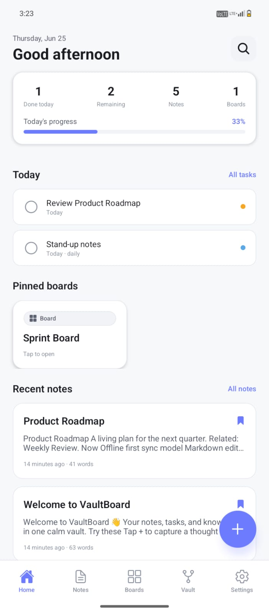 | 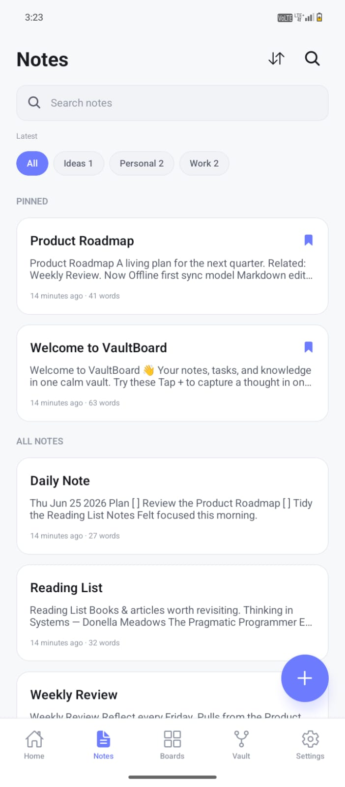 | 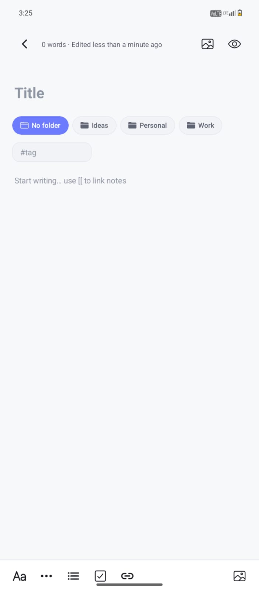 |
| **Kanban board** | **Card editor** | **Vault / graph** |
| 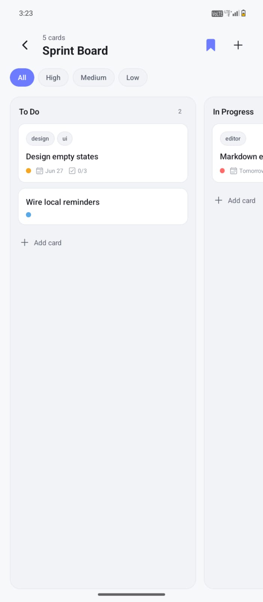 | 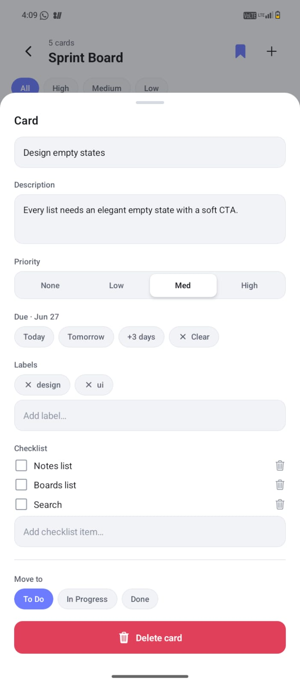 | 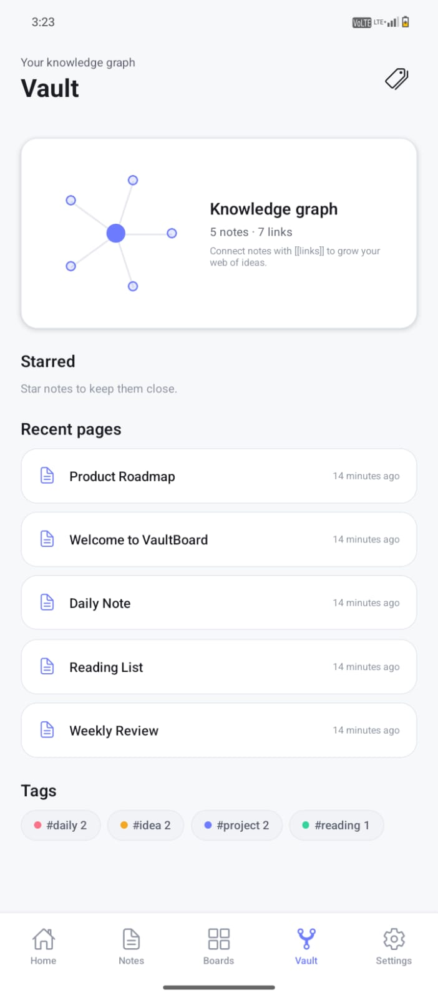 |
| **Tasks** | **Tags & folders** | **Settings** |
| 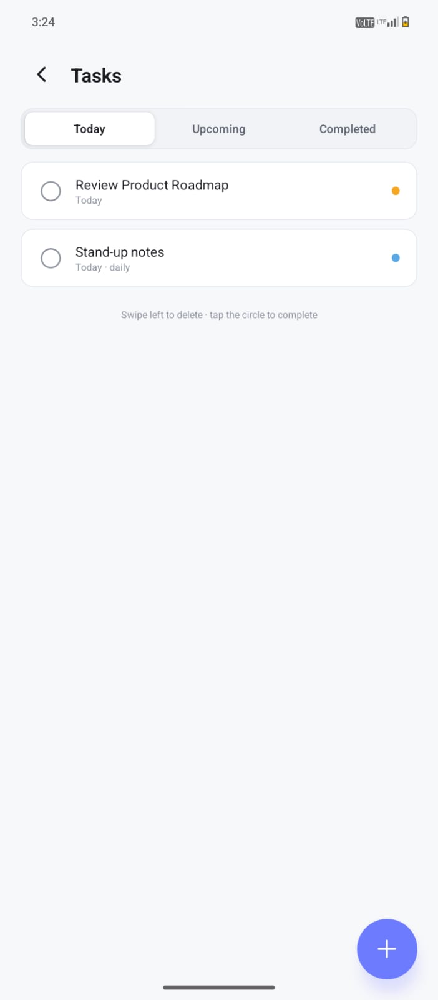 | 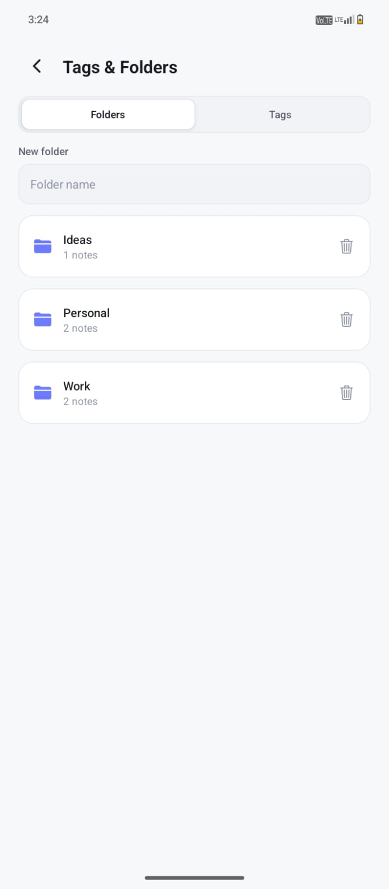 | 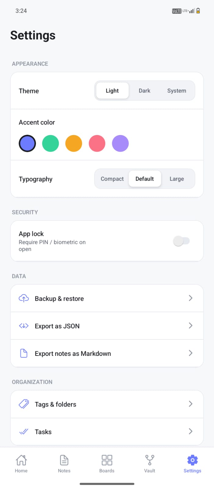 |
| **Quick add** | **Backup & restore** | **Onboarding** |
| 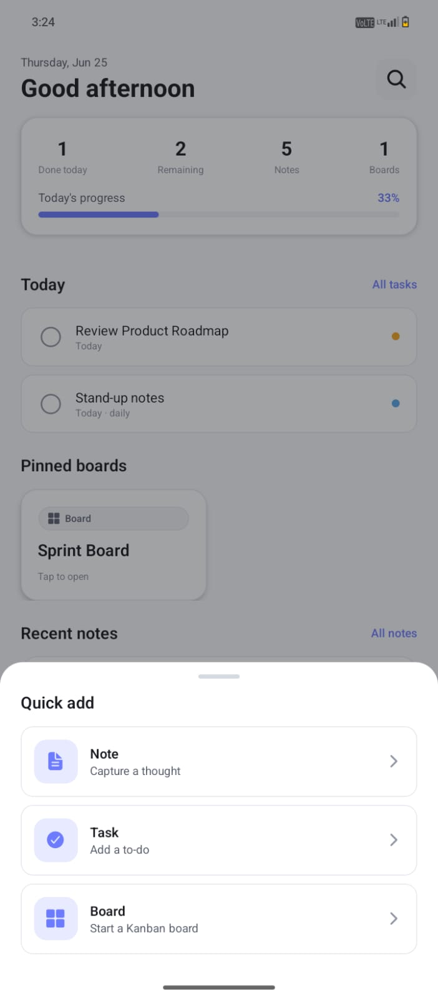 | 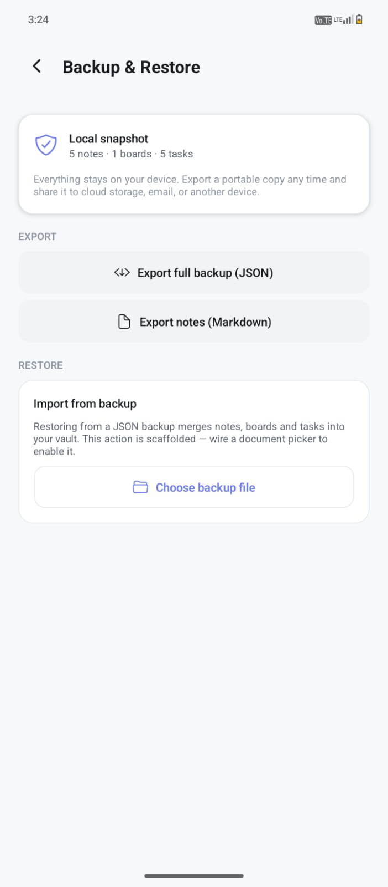 | 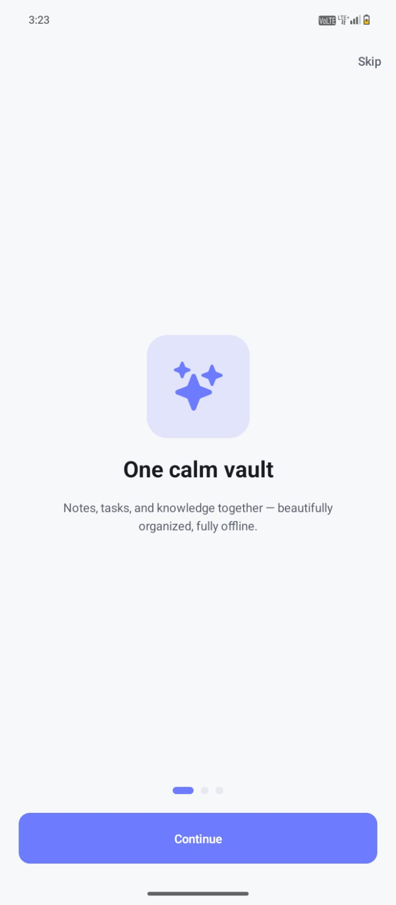 |

---

## ✨ Features

- **🏠 Home dashboard** — today's tasks, recent notes, pinned boards, a productivity summary, and a one‑tap Quick‑Add button.
- **📝 Notes** — markdown editor with **auto‑save**, live word count, tags, folders, cover images, pin/favorite, duplicate, and swipe actions.
- **🔗 Linked knowledge** — connect notes with `[[wiki links]]` and see **backlinks** on every note; a lightweight knowledge‑graph hint in the Vault.
- **📋 Kanban boards** — columns, drag‑to‑reorder cards, move between columns, with priority, due dates, labels, and checklists.
- **✅ Tasks** — Today / Upcoming / Completed views, priorities, due dates, and **recurring** tasks.
- **🔍 Global search** — instant full‑text search across notes, tasks, and cards (SQLite **FTS5**), with type filters.
- **🎨 Theming** — light / dark / system, five accent colors, and an adjustable typography scale.
- **💾 Your data, yours** — export to **JSON** or **Markdown**, share anywhere. 100% offline.

---

## 🧰 Tech stack

| Concern | Choice |
| --- | --- |
| Runtime | **Expo (managed)** + TypeScript |
| Navigation | React Navigation (native‑stack + bottom‑tabs) |
| State | **Zustand** (thin slices over the DB) |
| Persistence | **expo‑sqlite** with an **FTS5** virtual table + triggers |
| Animation / gesture | Reanimated 4, Gesture Handler, draggable‑flatlist |
| Validation | Zod |

---

## 🚀 Getting started

```bash
# 1. Install dependencies
npm install

# 2. Run in a development build (Expo Go won't include the native modules)
npx expo start --dev-client
```

On first launch the database is migrated and seeded with realistic demo content (linked notes, a populated "Sprint Board", tasks, tags, and folders) so the app feels alive immediately.

### Build a standalone release APK

The native `android/` project is generated (not committed), so regenerate it first:

```bash
# Generate the native project from app.json
npx expo prebuild --platform android

# Build the release APK (needs JDK 17 or 21)
cd android
./gradlew assembleRelease
# → android/app/build/outputs/apk/release/app-release.apk
```

---

## 📂 Project structure

```
src/
  navigation/   RootNavigator, BottomTabs, typed routes
  screens/      home · notes · boards · vault · tasks · search · settings · onboarding
  components/
    ui/         design-system primitives (Text, Surface, Button, Chip, BottomSheet, FAB…)
    notes/      MarkdownView, NoteCard
    boards/     KanbanColumn, KanbanCard, CardDetailSheet
    tasks/      TaskRow
    vault/      GraphHint
  store/        zustand slices: settings, notes, boards, tasks, library, ui
  db/           sqlite client, schema, migrations, FTS, seed, query modules
  services/     attachments (image picker), export (JSON / Markdown)
  theme/        tokens, palettes, ThemeProvider, useThemedStyles
  hooks/        useDebounce, useAutosave, useKeyboardHeight, useRefreshOnFocus
  types/ utils/ shared domain types & helpers (date, id, text, validation)
```

## 🗃️ Data model

SQLite tables: `notes`, `folders`, `tags`, `note_tags`, `note_links` (backlinks), `boards`, `columns`, `cards`, `card_labels`, `checklist_items`, `tasks`, `attachments`, `settings`, plus a `notes_fts` virtual table kept in sync by triggers. See [`src/db/schema.ts`](./src/db/schema.ts).

## 🗺️ Roadmap

Scaffolded with hooks/TODOs and ready to finish:

- [ ] Local reminders / notifications for due tasks
- [ ] Biometric / PIN app lock
- [ ] Calendar grid view for tasks
- [ ] Interactive knowledge graph
- [ ] Backup **restore** (import) — export already works

## 📄 License

[MIT](./LICENSE) © Lalit Rajpurohit
